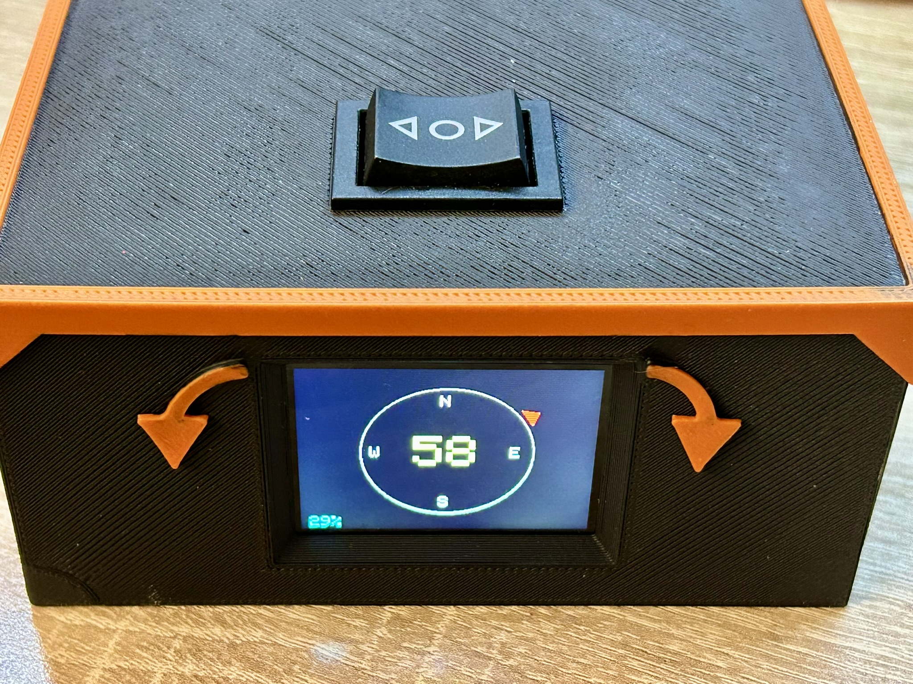

# Arduino Rotátor

Rotátor pro anténní systémy s víceotáčkovým potenciometrem a TFT displejem.



## Instalace a použití

1. **Nainstaluj knihovny** v Arduino IDE:
   - Adafruit GFX Library
   - Adafruit ST7789 Library

2. **Otevři a nahraj** program:
   - Soubor: `rotator_main/rotator_main.ino`
   - Board: Arduino UNO
   - Nahraj do Arduina

3. **Zapoj komponenty** podle schématu v `zapojeni_schema.txt`

4. **Kalibruj**: Nastav potenciometr na střed (50%) = 180° (jih)

## 📁 Struktura projektu

```
Rotator/
├── rotator_main/
│   └── rotator_main.ino        # Hlavní program (POUŽIJ TENTO)
├── zapojeni_schema.txt          # Zapojení pinů
├── PROJEKT.md                   # Kompletní dokumentace
└── README.md                    # Tento soubor
```

## ⚙️ Specifikace

- **Potenciometr**: 5kΩ lineární, 10 otáček
- **Převod**: 6:1 (96:16 zubů)
- **Displej**: ST7789V 240x320 px
- **Azimut**: 0-360° (střed 50% = 180°)
- **Limity**: hystereze 9/12 % (dolní) a 91/88 % (horní) + FAIL-SAFE při chybě A0

## 📖 Dokumentace

Viz **PROJEKT.md** pro kompletní dokumentaci projektu včetně:
- Detailního zapojení
- Kalibrace a nastavení
- Řešení problémů
- Možná rozšíření

## 🛠️ Podpora

Otevřený projekt pro radioamatérské použití.

---

**Status:** ✅ Funkční verze  
**Verze:** 1.0

## Stabilizace signálu A0 (30 m kabel)

- Buffer u potenciometru: MCP6001/MCP6002 jako sledovač.
- RC filtr u Arduina: 220 Ω sériově do A0 + 100 nF na GND (volitelně 1 µF).
- Firmware: oversampling + EMA filtr + hystereze limitů + FAIL-SAFE stav relé.
- Podrobné zapojení viz `zapojeni_schema.txt`.
